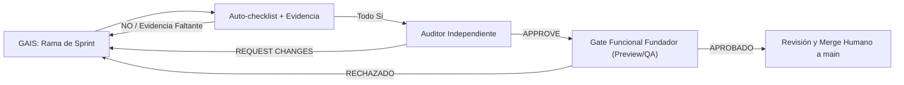

# 🛡️ PLAN DEFINITIVO UNIFICADO — INDUSTRIAL CONTROL 360 (v1.2)
## Guía Canónica de Estabilización, Seguridad, Preview/QA y Fase 2 (S14.2 a S22)
### Repositorio: `wolvesglobalsolutionsgroup-rgb/Industrial-360-App` — Fuente de verdad: `main`

> **NOTA DE PRIORIDAD CANÓNICA (v1.2):** El acceso del fundador y la visibilidad visual del producto NO esperan al final de la fundación técnica. Inmediatamente tras cerrar el núcleo técnico de **S14.2**, se ejecuta **S14.2A (Provisionamiento seguro del fundador y acceso QA/Preview)** como prioridad absoluta para eliminar la pantalla "Asignación de Membresía Pendiente" de forma autorizada server-side. Seguidamente se ejecuta **S14.2B (Preview automático por PR y Centro de Validación)** antes de continuar con S14.3 a S22.

---

## 📌 PRINCIPIOS CANÓNICOS OPERATIVOS

| Área | Decisión Definitiva |
|---|---|
| **Fuente de Verdad** | Rama `main` identificada por SHA real del commit. |
| **Desarrollo** | Exclusivamente en ramas `sprint/IC360-SXX-nombre`. Prohibido trabajo directo en `main`. |
| **Preflight** | Verificar primero `git status --short`. Si hay cambios inesperados, detenerse. |
| **Cierre de Sprint** | Cuatro capas obligatorias: (1) Auto-checklist GAIS, (2) Auditoría independiente, (3) Gate Funcional del Fundador en Preview/QA, (4) Merge humano. |
| **Multi-tenant** | `orgId`, `projectId`, `membership` y `role` son obligatorios, sin fallback, validados server-side. |
| **Acceso Inmediato Fundador** | Prioridad S14.2A: Provisionamiento server-side de membership en tenant QA/Preview. Sin bypasses en cliente. |
| **Datos Regulatorios** | CCPP, LOTTT, BCV, IGTF, FCIU, Factor K y tarifas son datos versionados; el software no certifica validez legal. |
| **Idempotencia Offline**| Requiere Cloud Function + transacción atómica Admin SDK; UUID cliente por sí solo no basta. |
| **Documentos** | Sellos y QR se emiten server-side; QR no filtra tenant, proyecto, PII o rutas internas. |
| **UI** | Entornos Command Wall 4K, Workstation y Campo; preferencias separadas de `ProjectContext`. |
| **Métricas SaaS** | Solo fuentes backend verificables; sin fuente mostrar `"No disponible"`. |
| **Seguridad** | Sin secretos, PII en logs, hardcodes de tenant ni bypass de Rules/Functions. |

---

## 🔄 FLUJO DE DECISIÓN Y SECUENCIA REORDENADA DE SPRINTS



### 📅 SECUENCIA REORDENADA DE EJECUCIÓN (DESDE HOY)

```text
S14.2 actual → Auditoría Técnica → S14.2A (Acceso Fundador QA) → Validación Visual Fundador → S14.2B (Preview por PR) → S14.3 en adelante (con Preview obligatorio)
```

1. **S14.2 — Autoridad Multi-Tenant y RBAC Server-Side:** Org A no puede operar sobre Org B en pruebas negativas.
2. 🚨 **S14.2A — Provisionamiento Seguro del Fundador y Acceso QA/Preview (INMEDIATO):** Elimina el bloqueo de "Asignación de Membresía Pendiente" asignando membership autoritativa server-side en tenant QA con datos sintéticos.
3. 🚨 **S14.2B — Preview Automático por PR y Centro de Validación:** Habilita el pipeline Preview por PR y la pantalla de estado de validación.
4. **S14.3 — Outbox e Idempotencia Transaccional:** 100 reintentos de una operación producen exactamente un solo efecto.
5. **S14.4 — Portal Público y Sellos Seguros:** Token rotativo/revocable, rate limit y cero filtración de metadatos.
6. **S14.5 — Supply Chain, CI y Release Gates:** Sin vulnerabilidades High/Critical y CI bloqueante.
7. **S15 a S22 — Sprints de Producto Fase 2:** Cada uno sujeto a Preview obligatorio y validación visual del fundador antes del merge.

---

## ⚠️ PROTOCOLO MAESTRO DE EJECUCIÓN PARA GAIS
*(Pegar este bloque antes de cada prompt de sprint)*

```text
⚠️ IC360 — PROTOCOLO MAESTRO DE EJECUCIÓN

Actúa como equipo coordinado:
- Principal Software Engineer
- Firebase / Cloud Functions Security Engineer
- QA Automation Engineer
- Industrial UX Engineer
- Especialista del dominio del sprint

PASO 0 — PREFLIGHT Y SINCRONIZACIÓN SEGURO
Ejecuta primero la alineación por terminal con el remoto oficial:
git remote remove origin 2>/dev/null
git remote add origin https://github.com/wolvesglobalsolutionsgroup-rgb/Industrial-360-App.git
git fetch origin --prune
git checkout main
git reset --hard origin/main
git status --short

Si el árbol aún contiene cambios locales inesperados no commiteados:
- detente inmediatamente;
- no modifiques archivos;
- reporta los cambios encontrados.

Solo con árbol 100% limpio y sincronizado con origin/main, ejecuta:
git rev-parse --short HEAD
git checkout -b sprint/IC360-S<NUMERO>-<nombre>
git status --short

ANTES DE ESCRIBIR CÓDIGO:
1. Lee completamente:
   - AGENTS.md
   - package.json
   - firebase.json
   - firestore.rules
   - storage.rules
   - ADRs y documentación del sprint
   - archivos reales que el sprint pretende modificar
   - pruebas, repositorios, Functions y tipos relacionados
2. Reporta:
   - SHA base auditado;
   - estado limpio del árbol;
   - rama creada;
   - archivos existentes y contratos reales encontrados;
   - archivos que se modificarán;
   - archivos que NO existen;
   - riesgo, migración, compatibilidad y rollback;
   - contradicciones con AGENTS.md o arquitectura real.

REGLAS INMUTABLES:
- Prohibido cambiar, hacer push o merge directo a main.
- Prohibido ejecutar firebase deploy.
- Prohibido usar o reintroducir semax_pino y PROJ-001.
- Prohibido hardcodear orgId, projectId, role, membership, tasas, porcentajes regulatorios, FCIU, BCV, IGTF, CCPP, Factor K, tokens, secretos, URLs productivas, cuotas o métricas ficticias.
- Prohibido poner enlaces firmados temporales, credenciales, tokens, secretos o parámetros sensibles en código, tests, documentación, commits, PRs o logs.
- orgId, projectId, role y membership son obligatorios y se validan server-side. El body del cliente no es una fuente de autoridad.
- Si falta contexto, devolver error explícito. Nunca usar fallback.
- Prohibido introducir any nuevo en dominio, cálculos, repositorios, Functions, exportadores o contratos de seguridad.
- No crear una colección, tipo, motor, contexto, repositorio, exportador o componente paralelo antes de comprobar la implementación existente.
- Toda mutación requiere validación, autorización, auditoría e idempotencia transaccional cuando pueda reintentarse.
- Valores CCPP, LOTTT, BCV, IGTF, Factor K, normas y políticas laborales requieren fuente, vigencia, versión y aprobación humana habilitada. El software los versiona y aplica; no los certifica legalmente.
- No presentar mocks, estimaciones o números sin fuente como datos reales.
- No declarar terminado un sprint si falla una validación o falta evidencia.

VALIDACIONES BASE:
- npm ci
- npm run lint
- npx tsc --noEmit
- npm run test:all
- npm run build
- npm audit --omit=dev --audit-level=high
- npm run audit:no-hardcoded-tenant, solamente si el script existe
- pruebas de Emulator, Functions, E2E, accesibilidad, carga, conflicto o documentos según el sprint

ENTREGA:
- SHA inicial y final;
- archivos modificados;
- decisiones técnicas;
- resultado real de comandos;
- pruebas ejecutadas;
- migración y rollback;
- riesgos abiertos;
- PR recomendado, sin mergear;
- Auto-checklist canónico completo.
```

---

## 🛡️ SPRINTS DE FUNDACIÓN Y HABILITACIÓN PRIORITARIOS

### 🎯 S14.2 — AUTORIDAD MULTI-TENANT Y RBAC SERVER-SIDE

```text
🎯 S14.2 — AUTORIDAD MULTI-TENANT Y RBAC SERVER-SIDE

Inspecciona primero:
- firestore.rules;
- ensureOwnClaims;
- useAuthClaims;
- ProjectContext;
- memberships;
- repositorios;
- Functions mutantes;
- tests de Rules y Emulator.

Implementa únicamente lo confirmado como necesario:
1. Consolida un autorizador reusable server-side que:
   - exija auth;
   - reciba orgId y projectId obligatorios;
   - consulte membership activa;
   - valide roles permitidos;
   - verifique que el proyecto pertenezca a la organización;
   - rechace inconsistencias entre claims, body y ruta.
2. Refactoriza ensureOwnClaims:
   - roles y orgId proceden solo de membership autoritativa;
   - nunca de documentos editables por cliente;
   - ausencia de membership retorna estado explícito;
   - no revocar refresh tokens innecesariamente.
3. Protege todas las Functions mutantes con el autorizador reusable.
4. Endurece Rules:
   - cliente no crea/edita roles, claims, memberships, sellos, counters, audit logs o approvals;
   - fallback final deny;
   - sin wildcard permisivo.
5. Pruebas obligatorias:
   - Org A vs Org B: get/list/create/update/delete;
   - usuario sin membership;
   - rol bajo intenta escalar privilegio;
   - cliente no emite sello ni portal;
   - perfil editable no altera autorización.

No despliegues. Abre PR sin mergear.
```

---

### 🚨 S14.2A — PROVISIONAMIENTO SEGURO DEL FUNDADOR Y ACCESO QA/PREVIEW (PRIORIDAD INMEDIATA)

```text
⚠️ CAMBIO DE PRIORIDAD — EJECUTAR INMEDIATAMENTE DESPUÉS DEL CIERRE TÉCNICO DE S14.2

No inicies S14.3, S14.4 ni S14.5 todavía. El fundador está autenticado, pero la aplicación muestra “Asignación de Membresía Pendiente”; por ello no puede validar visualmente su propio producto.

Renombra el siguiente trabajo como:
S14.2A — PROVISIONAMIENTO SEGURO DEL FUNDADOR Y ACCESO QA/PREVIEW

Este es un bloqueante operativo de aprobación humana. Debe ejecutarse inmediatamente después de completar el PR actual de S14.2, antes de continuar con cualquier otro sprint.

OBJETIVO
Permitir que el fundador entre de forma autorizada al tenant QA/Preview, con datos sintéticos, sin bypasses de seguridad ni permisos desde cliente.

PRECONDICIÓN
Antes de iniciar S14.2A:
1. Termina S14.2 actual.
2. Ejecuta el Auto-Checklist completo.
3. Abre PR de S14.2, sin merge.
4. Reporta exactamente:
   - SHA base y SHA final;
   - rama;
   - pruebas de Org A contra Org B;
   - prueba de usuario sin membership bloqueado;
   - prueba de claims derivados solo de membership server-side.
5. No hagas merge hasta recibir auditoría y aprobación humana.

EJECUCIÓN S14.2A
1. Crea una nueva rama desde main actualizado: sprint/IC360-S14.2A-founder-qa-access
2. Inspecciona primero:
   - ensureOwnClaims;
   - Cloud Functions de autorización;
   - esquema organizations/{orgId}/memberships/{uid};
   - useAuthClaims;
   - ProjectContext;
   - ProtectedRoute;
   - firestore.rules;
   - scripts de seed y datos sintéticos actuales.
3. Implementa una ruta administrativa server-side y auditada para:
   - provisionar una membership activa en un tenant QA;
   - asignar el rol autorizado necesario para revisar módulos QA;
   - emitir/refrescar Custom Claims desde esa membership;
   - revocar la membership de forma reversible;
   - registrar actor, fecha, motivo y resultado en audit log.
4. Restricciones:
   - no hardcodear email, UID, orgId ni rol;
   - no usar localStorage, query params, VITE variables ni frontend como autoridad;
   - no tocar tenants ni usuarios de producción;
   - no otorgar platformAdmin desde una membership tenant;
   - no usar datos reales;
   - no cambiar Rules para permitir acceso global;
   - no introducir bypass de ProtectedRoute.
5. QA tenant:
   - crear o reutilizar únicamente un tenant de datos sintéticos;
   - banner permanente: “PREVIEW / QA — Datos sintéticos — No usar para operación real”;
   - los datos se deben identificar como no operacionales;
   - la cuenta fundada debe ver módulos según membership real.
6. Pruebas:
   - fundador con membership QA entra y navega módulos QA;
   - usuario autenticado sin membership permanece bloqueado;
   - usuario de tenant regular no obtiene platformAdmin;
   - Org A no puede acceder a Org B;
   - revocación bloquea acceso después de refresh controlled;
   - ningún dato de producción se lee o escribe;
   - Firebase Emulator, Functions y E2E aplicables verdes.
7. Entrega:
   - PR separado sin merge;
   - guía exacta para que el fundador inicie sesión, actualice token y entre al tenant QA;
   - SHA, pruebas reales, rollback y riesgos;
   - Auto-Checklist canónico completo.

NO continúes con S14.3 hasta que el fundador haya podido entrar y validar visualmente el entorno QA.
```

---

### 🎯 S14.2B — PREVIEW AUTOMÁTICO POR PR Y CENTRO DE VALIDACIÓN

```text
🎯 S14.2B — PREVIEW AUTOMÁTICO POR PR Y CENTRO DE VALIDACIÓN

CONTEXTO
Con la membership QA activa (S14.2A), habilita la infraestructura de despliegue Preview por PR para que cada cambio técnico genere un entorno navegable y visible antes del merge.

1. Pipeline Preview:
   - Configura GitHub Actions / Firebase Hosting / Vercel para generar URL Preview efímera por cada PR.
   - Cada Preview utiliza únicamente Firebase QA y datos sintéticos.
   - Si faltan secrets o tokens externos, documenta `docs/runbooks/PREVIEW_SETUP.md` dejando el workflow listo e inactivo sin inventar credenciales.
2. Centro de Validación de Producto:
   - Extiende `PlatformOwnerConsole` (o componente real) para mostrar catálogo de sprints, estados (EN_DESARROLLO, LISTO_QA, APROBADO, BLOQUEADO), SHA, PR y enlace Preview.
   - Visible solo para usuarios autorizados en entorno QA/Preview.
3. Pruebas:
   - Build de PR genera Preview sin tocar producción;
   - Catálogo muestra información veraz desde manifiesto autorizado.

No despliegues producción. Abre PR sin mergear.
```

---

### 🎯 S14.3 — OUTBOX E IDEMPOTENCIA SERVER-SIDE

```text
🎯 S14.3 — OUTBOX E IDEMPOTENCIA SERVER-SIDE

Inspecciona:
- Dexie schema;
- src/lib/offline;
- outbox;
- syncEngine;
- Functions;
- entidades offline;
- Rules y pruebas existentes.

Implementa una Callable Function syncOutboxMutation tipada con: orgId, projectId, entityType, operationType, operationId UUID v4, entityId opcional, expectedVersion y payload validado.

La Function debe:
1. Validar auth, tenant, proyecto, membership y rol.
2. Restringir entityType y operationType por allow-list.
3. Ejecutar transacción Admin SDK.
4. Consultar idempotency key tenant-scoped.
5. Si existe, devolver duplicate y resultado anterior.
6. Si no existe, validar versión, aplicar mutación, registrar key y audit log en la misma transacción.
7. Rechazar cliente leyendo o escribiendo idempotency keys.

Refactoriza el cliente para usar únicamente esta Function en mutaciones offline críticas.

Conflictos:
- PTW, QA/QC, valuaciones, asistencia, sellos y aprobaciones: bloqueo.
- Evidencia/fotos: append-only.
- Reportes no críticos: conflicto visible y resolución autorizada.

Pruebas:
- 100 retries con mismo operationId crean un efecto;
- corte antes, durante y después del commit;
- respuesta perdida retorna duplicate;
- usuario revocado;
- conflicto entre dos usuarios;
- Org A no alcanza recursos de Org B.

No despliegues. PR sin merge.
```

---

### 🎯 S14.4 — PORTAL PÚBLICO Y SELLOS DOCUMENTALES SEGUROS

```text
🎯 S14.4 — PORTAL PÚBLICO Y SELLOS DOCUMENTALES SEGUROS

Inspecciona portal, sellos, verificadores QR, Functions, logging, CORS, rate limits, Firestore/Storage Rules y pruebas existentes.

Implementa o corrige:
1. Token de portal:
   - 32 bytes criptográficos;
   - persistir hash/HMAC, nunca token plano;
   - comparación en tiempo constante;
   - expiración, rotación y revocación;
   - entrega única del token al creador autorizado.
2. Rate limit:
   - clave por IP normalizada y portalId;
   - no depende de req.user;
   - persiste server-side;
   - 429 + retryAfterSeconds.
3. Portal:
   - no requiere JWT;
   - muestra solo widgets publicados;
   - no filtra orgId, projectId, storagePath, token, PII ni metadata interna;
   - CORS explícito, sin wildcard inseguro.
4. Sello:
   - se emite por Function autorizada;
   - SHA-256 sobre bytes finales;
   - versión append-only;
   - QR a endpoint de verificación mínimo.
5. Audit log:
   - creación, uso, rotación y revocación;
   - nunca loguear token.

Pruebas:
- token ausente, inválido, expirado, revocado y válido;
- rate limit;
- ausencia de token en logs;
- tenant isolation;
- alteración de byte cambia hash.

No despliegues. PR sin merge.
```

---

### 🎯 S14.5 — SUPPLY CHAIN, CI Y RELEASE GATE

```text
🎯 S14.5 — SUPPLY CHAIN, CI Y RELEASE GATE

Inspecciona workflows, package.json, lockfile, scripts y política de release.

Implementa:
1. CI bloqueante:
   - npm ci;
   - lint;
   - tsc;
   - build;
   - tests;
   - Rules/Storage Emulator;
   - Gitleaks;
   - npm audit producción;
   - auditoría de hardcodes;
   - SBOM como artefacto.
2. Crear npm run audit:no-hardcoded-tenant si no existe. Debe detectar al menos:
   - semax_pino;
   - PROJ-001;
   - fallbacks conocidos de orgId/projectId;
   - patrones de secretos prohibidos.
3. No usar continue-on-error en controles de seguridad críticos.
4. Crear:
   - docs/security/CVE_EXCEPTIONS.md;
   - docs/runbooks/RELEASE_GATE.md;
   - plantilla de PR;
   - política de rollback.
5. Configurar Renovate o Dependabot según sea compatible. No modificar dependencias mayores sin ADR y pruebas.

No despliegues. PR sin merge.
```

---

## 🚀 SPRINTS DE FASE 2 (PRODUCTO E INGENIERÍA)

### 🎯 S15 — EXTENSIÓN DEL MOTOR APU, POLÍTICAS Y REAJUSTE

```text
🎯 S15 — EXTENSIÓN DEL MOTOR APU, POLÍTICAS Y REAJUSTE

Antes de escribir:
- lee completo ApuEstimation;
- lee excelExporter;
- identifica calculateApuUnitCost y todos sus usos;
- revisa parser BC3 existente;
- revisa tests de cálculos y valuaciones.

Implementa:
1. Extraer calculateApuUnitCost a src/lib/engineering/apuCalculator.ts:
   - mantener firma y lógica USD existente;
   - actualizar todos los imports;
   - confirmar con rg que existe una sola definición.
2. Añadir capa separada de reajuste:
   - contratos VES, USD y mixtos;
   - total VES no debe aplicar K indiscriminadamente después de USD->VES;
   - K se aplica al componente contractual definido por política;
   - validar coeficientes y tolerancia de suma;
   - soportar componente local e importado cuando aplique.
3. Modelar EffectivePolicy/Rate: id, kind, value decimal, currency, effectiveFrom, effectiveTo, sourceDocumentId/sourceUrl, approvedBy, approvedAt, version, status.
4. Modelar salario integral/política laboral como datos: nivel ocupacional, condición de trabajo, antigüedad, fondo de ahorro, descanso remunerado, prestaciones, bono vacacional, utilidades y demás campos requeridos por la política aprobada. No convertir tablas sugeridas en constantes normativas sin aprobación humana.
5. IGTF:
   - condicional por tipo de transacción y política vigente;
   - no aplicarlo automáticamente a toda conversión.
6. Si falta o está vencida una tasa/política:
   - bloquear cálculo final;
   - explicar el dato faltante;
   - no inventar fallback.
7. Usar decimal/bigint para dinero y tasas. Sin redondeo intermedio no documentado.

Pruebas:
- golden tests del motor anterior;
- tasa vigente, vencida y ausente;
- K con coeficientes válidos/inválidos;
- IGTF aplicable/no aplicable;
- contratos VES/USD/mixtos;
- precisión, negativos, cero y redondeos;
- una definición de calculateApuUnitCost.

No despliegues. PR sin merge.
```

---

### 🎯 S16 — PERSONAL, HHT, SIHO Y QR ROTATIVO

```text
🎯 S16 — PERSONAL, HHT, SIHO Y QR ROTATIVO

Antes de modificar:
- lee WorkerQrRegistry completo;
- identifica FieldWorker, AttendanceRecord, QR, carnet, outbox y Rules;
- confirma la colección canónica y repositorio real;
- no renombres ni crees collection alternativa sin ADR y migración.

Implementa únicamente brechas confirmadas:
1. Política laboral versionada: jornada, zona horaria, turno, descansos, recargos, vigencia, fuente, versión, aprobación y snapshot.
2. Estado SIHO: apto, apto con restricción, observación, no apto, vencido; fecha de vencimiento y revalidación requerida.
3. QR:
   - credentialId opaco;
   - token firmado, rotativo y de TTL definido por policy;
   - revocación inmediata;
   - sin cédula, nombre, SIHO médico, empresa o secreto reutilizable;
   - validación online server-side;
   - offline con caché autorizada de ventana limitada y estado pendiente.
4. Asistencia:
   - evento idempotente append-only;
   - usuario, dispositivo, hora local, hora servidor, frente de obra y sync state;
   - correcciones con supervisor, reasonCode y audit log.
5. HHT:
   - normal, extra, nocturna normal y extra nocturna cuando policy aplique;
   - métricas total, sin accidentes y sin incapacitantes;
   - excluir o alertar sobre personal no apto/vencido para tareas de riesgo.
6. Accidente:
   - no afirmar envío regulatorio automático sin validación legal;
   - preparar workflow configurable, evidencia y SLA de notificación para responsable de seguridad.

Pruebas:
- QR expirado, revocado, copiado y duplicado;
- duplicado de asistencia no duplica HHT;
- SIHO vencido bloquea/alerta según policy;
- offline y reintento;
- tenant isolation;
- corrección auditada.

No despliegues. PR sin merge.
```

---

### 🎯 S17 — COSTO HORARIO DE EQUIPOS Y MANTENIMIENTO

```text
🎯 S17 — COSTO HORARIO DE EQUIPOS Y MANTENIMIENTO

Antes de modificar:
- confirma archivo real de equipos; no asumas EquipmentRegistry;
- revisa FleetEquipment, Inventory, repositorios y motores existentes;
- identifica propietario de cada dominio.

Implementa:
1. Motor tipado y puro:
   - calculateCHP;
   - calculateCHO;
   - calculateHourlyRate;
   - calculateFuelVariance;
   - calculateMaintenanceDue.
2. CHP: depreciación, capital, seguros, mantenimiento mayor y otros componentes definidos por policy.
3. CHO: combustible, lubricantes, neumáticos/orugas, operador y variables de carga/uso definidas por policy.
4. Datos:
   - horómetro append-only;
   - consumo de combustible con unidad, evidencia y origen;
   - correcciones como eventos de ajuste;
   - moneda, vida útil, residual, horas anuales, seguro y tasas versionadas.
5. Mantenimiento:
   - schedule por activo, fabricante/modelo y criticidad;
   - no alerta global fija de 250h;
   - estados operating, standby e idle si corresponden al catálogo.
6. Integración:
   - operador toma costo laboral desde S15 por referencia/snapshot;
   - APU consume tarifa por contrato tipado, no números duplicados.

Pruebas:
- CHP/CHO separados;
- horas cero, moneda inválida, residual inválido y unidades;
- schedule configurable;
- standby vs operating;
- integración con APU;
- cross-tenant.

No despliegues. PR sin merge.
```

---

### 🎯 S18 — BRANDKIT, DOBLE MEMBRETE Y SELLO SEGURO

```text
🎯 S18 — BRANDKIT, DOBLE MEMBRETE Y SELLO SEGURO

Antes de modificar:
- lee ProjectContext y tipo BrandKit canónico;
- lee Settings y flujos de membrete;
- busca interfaces/exports de BrandKit existentes;
- no crear tipo BrandKit paralelo.

Implementa:
1. Presets tenant-scoped: PDVSA, Chevron, Repsol y ENI como draft configurables. No afirmar certificación, ni usar logos sin autorización.
2. Crear componentes nuevos si no existen:
   - DualHeader;
   - DocumentSeal;
   - DocumentSigner para firmas 1:N.
3. Cada documento conserva: templateVersion, brandKitVersion, documentVersion, sealVersion, locale, timezone y signers.
4. Hora legal:
   - centralizar fecha/hora de documento en política de zona;
   - usar America/Caracas donde el documento/proyecto corresponda;
   - evitar timestamps ambiguos.
5. Sello:
   - emitido solo por Function autorizada;
   - SHA-256 de bytes finales;
   - QR mínimo;
   - VERIFIER_BASE_URL viene de configuración segura;
   - ausencia de configuración debe fallar explícitamente, no usar fallback.
6. Integrar en PTW, QA/QC y valuaciones solo tras confirmar archivos reales.

Pruebas:
- no hay BrandKit duplicado;
- preset draft no se emite como approved;
- QR no filtra datos internos;
- alteración de bytes cambia hash;
- versión de BrandKit queda congelada en documento;
- validación build-time de configuración requerida.

No despliegues. PR sin merge.
```

---

### 🎯 S19 — DOCX, XLSX, PPTX Y PDF INMUTABLE DE CIERRE

```text
🎯 S19 — DOCX, XLSX, PPTX Y PDF INMUTABLE DE CIERRE

Antes de escribir:
1. Lee excelExporter completo.
2. Ejecuta npm ls exceljs docx pptxgenjs.
3. Si docx/pptxgenjs faltan: npm install docx pptxgenjs reporta versiones y lockfile.
4. Si falla la instalación, detente; no inventes imports ni .d.ts.

Implementa:
1. Contrato único DocumentViewModel para DOCX/XLSX/PPTX.
2. DOCX:
   - doble membrete en tabla editable;
   - firmas 1:N;
   - texto, tablas, caracteres acentuados e imágenes.
3. XLSX:
   - extender/reutilizar excelExporter actual;
   - no crear descargador paralelo;
   - fórmulas reales, fuentes y snapshots;
   - IGTF solo cuando policy lo determine;
   - formato VES es-VE;
   - probar que cell.formula es string y no undefined.
4. PPTX:
   - layout 16:9;
   - doble membrete;
   - manejo de títulos, tablas, logos largos y fuente compatible.
5. Cierre:
   - exportables editables son la versión de trabajo;
   - PDF final congelado se sella con SHA-256 y versión documental;
   - no confundir PDF sellado con documento editable.

Pruebas:
- roundtrip/estructura de DOCX, XLSX y PPTX;
- apertura real documentada en Word, Excel, LibreOffice y PowerPoint;
- fórmulas XLSX reales;
- layout PPTX;
- caracteres, unidades, tablas largas, imágenes, firmas y membretes;
- tenant isolation.

No despliegues. PR sin merge.
```

---

### 🎯 S20 — COMMAND WALL 4K, WORKSTATION Y CAMPO

```text
🎯 S20 — COMMAND WALL 4K, WORKSTATION Y CAMPO

Implementa DisplayEnvironmentContext independiente de ProjectContext.

Modos:
1. Command Wall:
   - objetivo 3840x2160;
   - OLED dark;
   - grid operativo sin scroll;
   - degradación a 1920x1080;
   - tokens semánticos;
   - mitigación documentada de burn-in para elementos persistentes.
2. Workstation:
   - alta densidad;
   - tablas virtualizadas;
   - navegación de teclado;
   - columnas persistentes.
3. Field Sunlight:
   - blanco/negro de alto contraste;
   - texto principal con ratio medido;
   - resto de pares relevantes conforme al estándar de accesibilidad definido;
   - botones y targets de 64 CSS px mínimo;
   - foco visible;
   - usable con guantes;
   - modo offline claramente visible.

Implementación:
- no colores arbitrarios en componentes;
- tokens semánticos en index.css;
- states loading/data/empty/error;
- prefers-reduced-motion y prefers-contrast.

Pruebas:
- Playwright y axe;
- teclado, foco, zoom, contraste y lector de pantalla;
- 3840x2160, 1920x1080, 1366x768, 1024x768, 768x1024 y 390x844;
- rendimiento e interacción medibles;
- no afirmar AAA sin evidencia.

No despliegues. PR sin merge.
```

---

### 🎯 S21 — SYNC CENTER Y RESOLUCIÓN DE CONFLICTOS

```text
🎯 S21 — SYNC CENTER Y RESOLUCIÓN DE CONFLICTOS

PRECONDICIÓN: S14.3 está cerrado. La Function transaccional es la única ruta de mutaciones offline críticas.

Antes de implementar:
- inspecciona offlineoutbox, syncEngine, conflictPolicy y Dexie;
- confirma funciones existentes antes de crear otras;
- conserva los contratos y no dupliques cola/idempotencia.

Implementa UI accesible Sync Center con:
- pending;
- syncing;
- synced;
- duplicate;
- conflict-blocked;
- failed;
- denied.

Cada elemento muestra: operationId, entidad, momento, último intento, motivo sanitizado y acción.

Conflictos:
- máquina de estados del dominio, no Last-Write-Wins ciego;
- opciones: mantener local, mantener servidor o combinar manualmente, con diff visible cuando policy lo permita;
- PTW, valuaciones, asistencia, QA/QC, sellos y aprobaciones bloquean.

Resiliencia:
- backoff exponencial con jitter;
- cola sobrevive reinicio;
- Service Worker Background Sync cuando soporte navegador;
- fallback explícito para navegadores sin Background Sync, incluido iOS Safari;
- documentar TTL de operationId y política de conservación.

Pruebas:
- 100 retries => un efecto;
- cierre de navegador;
- red antes/durante/después de commit;
- respuesta perdida;
- conflicto dos usuarios;
- cambio de sesión/membership;
- IndexedDB sin espacio;
- cross-tenant.

No despliegues. PR sin merge.
```

---

### 🎯 S22 — PLATFORM OWNER CONSOLE, FINOPS Y AUDITORÍA

```text
🎯 S22 — PLATFORM OWNER CONSOLE, FINOPS Y AUDITORÍA

Antes de escribir:
- lee PlatformOwnerConsole completo;
- reporta qué ya existe y qué falta;
- prohíbe reescritura masiva si el módulo ya funciona parcialmente;
- inspecciona claims, audit logs, telemetría y Functions.

Implementa solo brechas reales:
1. Identidad:
   - platformAdmin es distinto de superadmin de tenant;
   - backend valida acciones de plataforma;
   - acciones sensibles requieren step-up/MFA.
2. Métricas:
   - backend/agregados;
   - source, collectedAt, range, unit, status, confidence;
   - valores verificados, estimados o no disponibles;
   - nunca calcular métricas globales desde navegador de tenants;
   - mostrar “No disponible” cuando falte fuente.
3. SaaS B2B:
   - MRR, ARR, LTV, CAC, NRR y churn solo cuando exista fuente;
   - costo y consumo por tenant con límites/alertas;
   - alertas de cuota a 80%, crítica a 95%, degradación documentada a 100%.
4. Planes:
   - Plan/Entitlement versionado;
   - período de gracia configurable;
   - aviso anticipado;
   - suspensión reversible;
   - diseño preferente read-only antes de pérdida de acceso a evidencia crítica.
5. Auditoría:
   - append-only, hashPrev/hashActual para cadena verificable;
   - redacción configurable de PII;
   - actor, requestId, motivo y resultado sanitizado;
   - retención según política legal/contractual aprobada, no asumir duración sin revisión.
6. Transparencia:
   - cliente ve su consumo read-only según plan y autorización;
   - no ve datos de otros tenants.

Pruebas:
- tenant admin denegado;
- platformAdmin autorizado;
- métrica sin backend muestra No disponible;
- plan/suspensión/reversión auditados;
- MFA/step-up;
- cadena de auditoría verificable;
- PII redactada;
- aislamiento multi-tenant.

No despliegues. PR sin merge.
```

---

## 🧪 CAPA 1 — AUTO-CHECKLIST CANÓNICO DE CIERRE (GAIS)
*(Pegar al final del prompt de cada sprint)*

```text
🧪 AUTO-CHECKLIST CANÓNICO DE CIERRE — SPRINT S[NN]

No declares el sprint terminado sin responder cada punto con:
- Estado: SÍ / NO / NO APLICA
- Evidencia: archivos, pruebas, comandos y salida real
- Riesgo residual
- Si es NO o NO APLICA: justificación y acción pendiente

1. ¿Se reportaron SHA inicial/final y el trabajo ocurrió exclusivamente en una rama sprint, sin cambio directo a main?
2. ¿Se comprobó git status limpio antes de cambiar de rama y se leyó AGENTS.md?
3. ¿Se inspeccionaron archivos, tipos, Rules, Functions, dependencias y pruebas reales antes de crear o editar código?
4. ¿Se evitó duplicar módulos, motores, tipos, colecciones, repositorios, exportadores o contextos? Incluye rg/grep de fuente única de verdad.
5. ¿orgId, projectId, role y membership son obligatorios, no tienen fallback y se validan server-side?
6. ¿No se agregaron hardcodes, secretos, tokens, PII en logs, URLs productivas, tasas/reglas regulatorias constantes ni datos ficticios de producción?
7. ¿Las mutaciones tienen validación de entrada, autorización, audit log e idempotencia transaccional cuando pueden reintentarse?
8. ¿Las políticas económicas, laborales, normativas o de ingeniería tienen fuente, edición, vigencia, aprobación y snapshot versionado?
9. ¿Se preservó el aislamiento multi-tenant? Muestra prueba positiva y negativa entre dos organizaciones creadas para el test.
10. ¿Pasaron los comandos obligatorios aplicables?
    - npm ci
    - npm run lint
    - npx tsc --noEmit
    - npm run test:all
    - npm run build
    - npm audit --omit=dev --audit-level=high
    - auditoría de hardcodes, solo si el script existe
11. ¿Pasaron las pruebas específicas del sprint: Emulator, Functions, E2E, accesibilidad, carga, conflictos offline o artefactos de documento?
12. ¿Hay migración, compatibilidad, rollback, feature flag/kill switch cuando aplica, ADR y riesgo residual documentados?

RESULTADO:
- READY FOR INDEPENDENT AUDIT  o
- NOT READY — [lista exacta de bloqueantes]
```

### 📋 VALIDACIONES ADICIONALES POR SPRINT

| Sprint | Pregunta Obligatoria Adicional |
|---|---|
| **S14.2** | ¿Org A fue bloqueada en get/list/create/update/delete contra Org B? |
| **S14.2A** | ¿El fundador provisionado server-side entra al tenant QA y ve los módulos sin bypass en cliente? |
| **S14.2B** | ¿El PR genera una URL Preview navegable con datos QA sintéticos? |
| **S14.3 / S21** | ¿100 reintentos de la misma `operationId` generaron exactamente un efecto remoto? |
| **S14.4** | ¿Token ausente, inválido, vencido y revocado fue rechazado sin filtrar datos? |
| **S14.5** | ¿CI bloquea PR ante secreto, hardcode, vulnerabilidad High/Critical, fallo de tipos o tests? |
| **S15** | ¿Una tasa o policy vencida bloquea el cálculo sin inventar reemplazo? |
| **S16** | ¿QR evita PII, expira, se revoca y no duplica asistencia/HHT? |
| **S17** | ¿CHO/CHP están separados y mantenimiento viene de policy versionada? |
| **S18** | ¿El QR del sello no revela tenant, proyecto, Storage path ni documento? |
| **S19** | ¿DOCX/XLSX/PPTX abren realmente y XLSX conserva fórmulas activas? |
| **S20** | ¿Se probaron 4K, teclado, foco, contraste medido y targets de 64px? |
| **S22** | ¿Una métrica sin fuente backend aparece como “No disponible”? |

---

## 🏛️ CAPA 2 — AUDITORÍA INDEPENDIENTE POST-SPRINT

```text
🏛️ AUDITORÍA EMPÍRICA POST-SPRINT — IC360 S[NN]

No edites archivos. Audita [RAMA/PR] contra main. Confirma:
- SHA base y final;
- AGENTS.md y ADR leídos;
- diff y archivos completos revisados;
- resultados reales de CI y pruebas.

Busca:
- bypass de tenant, proyecto, rol o membership;
- hardcodes, secretos, tokens, PII y mocks engañosos;
- any nuevo injustificado;
- mutaciones sin autorización, auditoría o idempotencia;
- Rules, Storage o Functions debilitadas;
- colecciones, motores, tipos o exportadores duplicados;
- políticas económicas/normativas sin vigencia, fuente o aprobación;
- regresiones offline, accesibilidad, rendimiento o documentos;
- vulnerabilidades de producción;
- enlaces firmados, credenciales temporales o parámetros secretos en Git.

Entrega:
1. SHA y alcance auditado.
2. Hallazgos P0/P1/P2/P3 con archivo, evidencia, impacto y corrección.
3. Pruebas cubiertas, no cubiertas y faltantes.
4. Riesgo residual y rollback.
5. Veredicto único:
   - APPROVE
   - APPROVE WITH CONDITIONS
   - REQUEST CHANGES

No apruebes si existe P0/P1, evidencia faltante, fallo de CI o condición que afecte seguridad, tenant, datos, pruebas, migración o rollback.
```

---

## 👁️ CAPA 3 — GATE FUNCIONAL DEL FUNDADOR (PREVIEW / QA)

Para todo PR de producto (a partir de S14.2A):

```text
GATE FUNCIONAL DEL FUNDADOR
1. Existe URL Preview asociada al SHA del PR.
2. El fundador puede autenticarse en el entorno QA/Preview con membership server-side activa.
3. El catálogo de QA muestra alcance, pruebas, riesgos y estado real.
4. El fundador marca la validación como APROBADA o RECHAZADA.
5. Si está RECHAZADA, o no existe Preview sin excepción documentada, no hay merge.
```

---

## 👤 CAPA 4 — DECISIÓN Y MERGE HUMANO (FREDDY)

Antes de hacer merge a `main`, confirma las 7 preguntas:

1. ¿SHA inicial/final y rama del PR son verificables?
2. ¿Todos los comandos exigidos están verdes con evidencia real?
3. ¿Existe algún NO, NO APLICA, riesgo abierto o prueba omitida?
4. ¿El auditor emitió `APPROVE` y no existen P0/P1?
5. ¿El fundador ha probado en Preview/QA y marcado la validación como APROBADA?
6. ¿El PR no contiene secretos, hardcodes, enlaces firmados ni cambios ajenos?
7. ¿`main` permanece intacta y el merge será realizado por un humano?

---

## 🚦 REGLA DE AVANCE

| Situación | Acción |
|---|---|
| Auto-checklist completo, todo "Sí" y evidencia verde | Enviar a auditoría independiente |
| Auto-checklist con "No" o evidencia insuficiente | Corregir; no auditar ni mergear |
| Auditoría `APPROVE` | Enviar a Gate Funcional del Fundador en Preview/QA |
| Gate Funcional `APROBADA` | Revisión humana y merge humano a `main` |
| Gate Funcional `RECHAZADA` | Devolver a GAIS; no merge |
| `APPROVE WITH CONDITIONS` | Corregir antes de merge, salvo P3 documental aceptado |
| `REQUEST CHANGES` | Devolver a GAIS; no merge |
| P0/P1, prueba omitida, evidencia falsa o secreto | Sprint bloqueado |
