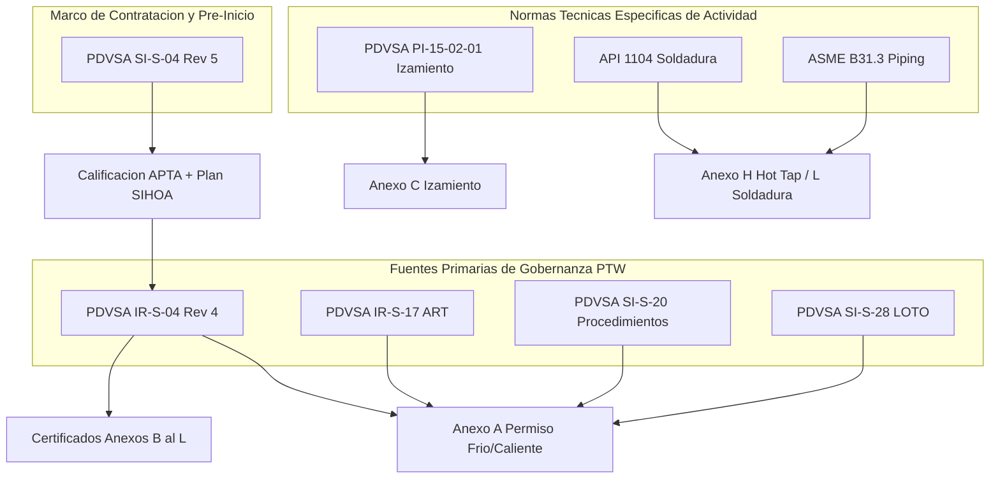

# WF-043: MATRIZ DE DEPENDENCIA DE FUENTES Y CLASIFICACIÓN DE CONFICATORIA

**Workflow:** WF-043 — Sistema de Permisos de Trabajo  
**Agente Auditor:** Antigravity  
**Fecha:** 2026-08-10  
**Confianza General:** `MEDIUM` (Gobernanza Core `HIGH`, Certificados Especiales `LOW_MEDIUM` por fuentes faltantes)  

---

## 1. FUENTES PRIMARIAS DE GOBERNANZA DEL PERMISO DE TRABAJO

| ID Fuente | Documento Oficial | Revisión / Fecha | Nivel Autoridad | Ubicación / Referencia | Estado |
|---|---|---|---|---|:---:|
| `SRC-IR-S-04` | PDVSA IR-S-04 — *Sistema de Permisos de Trabajo* | Rev. 4 (Agosto 2013) | **Nivel A (Gobernanza Primaria)** | `PDVSA_IR-S-04_Rev4_Ago2013.pdf` | `CONFIRMED` |
| `SRC-IR-S-17` | PDVSA IR-S-17 — *Análisis de Riesgos del Trabajo (ART)* | Rev. Octubre 2006 | **Nivel A (Gobernanza Primaria)** | `PDVSA_IR-S-17_OCTUBRE-2006.pdf` | `CONFIRMED` |
| `SRC-SI-S-20` | PDVSA SI-S-20 — *Procedimientos de Trabajo* | Rev. Noviembre 2006 | **Nivel A (Gobernanza Primaria)** | `PDVSA_SI-S-20_NOVIEMBRE-2006.pdf` | `CONFIRMED` |
| `SRC-SI-S-28` | PDVSA SI-S-28 — *Control de Fuentes de Energía (LOTO)* | Rev. Junio 2010 | **Nivel A (Gobernanza Primaria)** | `PDVSA_SI-S-28_JUNIO-2010.pdf` | `CONFIRMED` |
| `SRC-SI-S-04` | PDVSA SI-S-04 — *Requisitos SIHOA en Contratación* | Rev. 5 (Junio 2011) | **Nivel A (Marco Contratación)** | `PDVSA_SI-S-04...pdf` | `CONFIRMED` |

---

## 2. NORMAS TÉCNICAS ESPECÍFICAS DE ACTIVIDAD (SECUNDARIAS / ACTIVITY-SPECIFIC)

| ID Fuente | Documento Oficial | Edición / Fecha | Clasificación | Justificación Documental | Estado |
|---|---|---|---|---|:---:|
| `SRC-PI-15-02-01` | PDVSA PI-15-02-01 | Rev. P6 | **Específica de Actividad** | Aplica exclusivamente cuando se activa el Anexo C (Izamiento). | `CONFIRMED` |
| `SRC-API-1104` | API 1104 | 22nd Ed. (2021) | **Secundaria / Específica** | Aplica a soldadura de líneas y Hot Tapping (Anexo H / L). | `CONFIRMED` |
| `SRC-ASME-B31.3` | ASME B31.3 | Edición 2024 | **Secundaria / Específica** | Aplica a diseño y límites de presión en Hot Tapping (Anexo H). | `CONFIRMED` |

---

## 3. FUENTES REFERENCIADAS FALTANTES Y SU IMPACTO OPERATIVO (`MISSING_SOURCE`)

| ID Referencia | Norma Referenciada | Título / Objeto | Impacto Operativo Específico en WF-043 | Estado |
|---|---|---|---|:---:|
| `REF-HO-H-06` | PDVSA HO-H-06 | *Espacios Confinados* | Imposibilita validar límites de gases tóxicos y ventilación en Anexo B. | `MISSING_SOURCE` |
| `REF-SI-S-27/31` | PDVSA SI-S-27 / SI-S-31 | *Andamios y Altura* | Imposibilita validar cálculo de andamios y distancias a líneas en Anexo J. | `MISSING_SOURCE` |
| `REF-COVENIN-2247` | COVENIN 2247 | *Excavaciones* | Imposibilita validar límites de entibado y taludes de seguridad en Anexo E. | `MISSING_SOURCE` |
| `REF-SI-S-29/32` | PDVSA SI-S-29 / SI-S-32 | *Sistemas Eléctricos* | Imposibilita validar distancias de arco eléctrico y dieléctricos en Anexo F. | `MISSING_SOURCE` |
| `REF-IR-S-16` | PDVSA IR-S-16 | *Zonas de Seguridad* | Imposibilita validar franjas de seguridad (50m) en áreas compartidas en Anexo I. | `MISSING_SOURCE` |

---

## 4. ESTRUCTURA DE DEPENDENCIAS DOCUMENTALES

