# WF-043: MATRIZ DE DEPENDENCIA DE FUENTES Y ARQUITECTURA DE CAPAS

**Workflow:** WF-043 — Sistema de Permisos de Trabajo  
**Agente Auditor:** Antigravity  
**Fecha:** 2026-08-10  
**Confianza General:** `HIGH`  

---

## 1. FUENTES PRIMARIAS DE GOBERNANZA DEL PERMISO DE TRABAJO

| ID Fuente | Documento Oficial | Revisión / Fecha | Nivel Autoridad | Ubicación / Referencia | Estado |
|---|---|---|---|---|:---:|
| `SRC-IR-S-04` | PDVSA IR-S-04 — *Sistema de Permisos de Trabajo* | Rev. 4 (Agosto 2013) | **Gobernanza Primaria (Anexos A a L)** | `PDVSA_IR-S-04_Rev4_Ago2013.pdf` | `CONFIRMED` |
| `SRC-HO-H-16` | PDVSA HO-H-16 — *Notificación de Riesgos* | Rev. 2 (Abril 2013) | **Gobernanza Primaria (Notificación)** | `1.2 Notificación de riesgos...pdf` | `CONFIRMED` |
| `SRC-PR-H-08` | PDVSA PR-H-08 — *Transporte de Materiales Radiactivos* | Rev. 1 (Junio 2014) | **Gobernanza Primaria (Radiaciones)** | `PR-H-08...pdf` | `CONFIRMED` |
| `SRC-SI-S-04` | PDVSA SI-S-04 — *Requisitos SIHOA en Contratación* | Rev. 5 (Junio 2011) | **Marco Contratación / Pre-inicio** | `PDVSA_SI-S-04...pdf` | `CONFIRMED` |
| `SRC-IR-S-17` | PDVSA IR-S-17 — *Análisis de Riesgos (ART)* | Rev. Octubre 2006 | **Gobernanza Primaria (Riesgos)** | `IR-S-17.pdf` | `CONFIRMED` |
| `SRC-SI-S-20` | PDVSA SI-S-20 — *Procedimientos de Trabajo* | Rev. Noviembre 2006 | **Gobernanza Primaria (Procedimientos)** | `PDVSA_SI-S-20...pdf` | `CONFIRMED` |
| `SRC-SI-S-28` | PDVSA SI-S-28 — *Control de Fuentes de Energía (LOTO)* | Rev. Junio 2010 | **Gobernanza Primaria (LOTO)** | `PDVSA_SI-S-28...pdf` | `CONFIRMED` |

---

## 2. ESTRUCTURA DE CAPAS SEPARADAS DE ARQUITECTURA

```mermaid
graph TD
    subgraph Capa_1[1. ContractorEligibility]
        SI04[PDVSA SI-S-04 - Estatus Contratista APTA]
    end

    subgraph Capa_2[2. PreStartReadiness]
        PlanSIHOA[Plan Especifico SIHOA Anexo B SI-S-04]
        Inducción[Inducción / Notificación PDVSA HO-H-16]
        Visita[Verificación Conjunta en Sitio]
    end

    subgraph Capa_3[3. PTWCore]
        AnexoA[PDVSA IR-S-04 Anexo A Renglones 1-23]
        ART[PDVSA IR-S-17 ART No.]
        PROC[PDVSA SI-S-20 Procedimiento No.]
        GAS[Pruebas de Gases Quantitative]
    end

    subgraph Capa_4[4. SpecialCertificates]
        AnexoB[Anexo B Espacios Confinados]
        AnexoC[Anexo C Izamiento PI-15-02-01]
        AnexoD[Anexo D Radiaciones PR-H-08]
        AnexoE[Anexo E Excavaciones]
        AnexoF[Anexo F Eléctrico SI-S-28]
        AnexoG[Anexo G Subacuático]
        AnexoH[Anexo H Hot-Tap API 1104/ASME B31.3]
        AnexoI[Anexo I Áreas Compartidas]
        AnexoJ[Anexo J Altura]
        AnexoK[Anexo K Fumigación]
        AnexoL[Anexo L Soldadura API 1104]
    end

    subgraph Capa_5[5. ExecutionControl]
        Monitoreo[Monitoreo Continuo / Permanencia]
        Suspensión[Interrupción >1h Caliente / >2h Frío]
    end

    subgraph Capa_6[6. Extension]
        Prorroga[Prórroga Única Max 2h + Gas Test]
    end

    subgraph Capa_7[7. Closeout]
        Cierre[Cierre Tripartita + Sitio Ordenado]
    end

    subgraph Capa_8[8. Deliverables]
        Package[Expediente Digital ISO 19005-1]
    end

    subgraph Capa_9[9. Databook]
        DB[05.01_PERMISOS_DE_TRABAJO_PTW]
    end

    Capa_1 --> Capa_2 --> Capa_3 --> Capa_4 --> Capa_5 --> Capa_6 --> Capa_7 --> Capa_8 --> Capa_9
```

