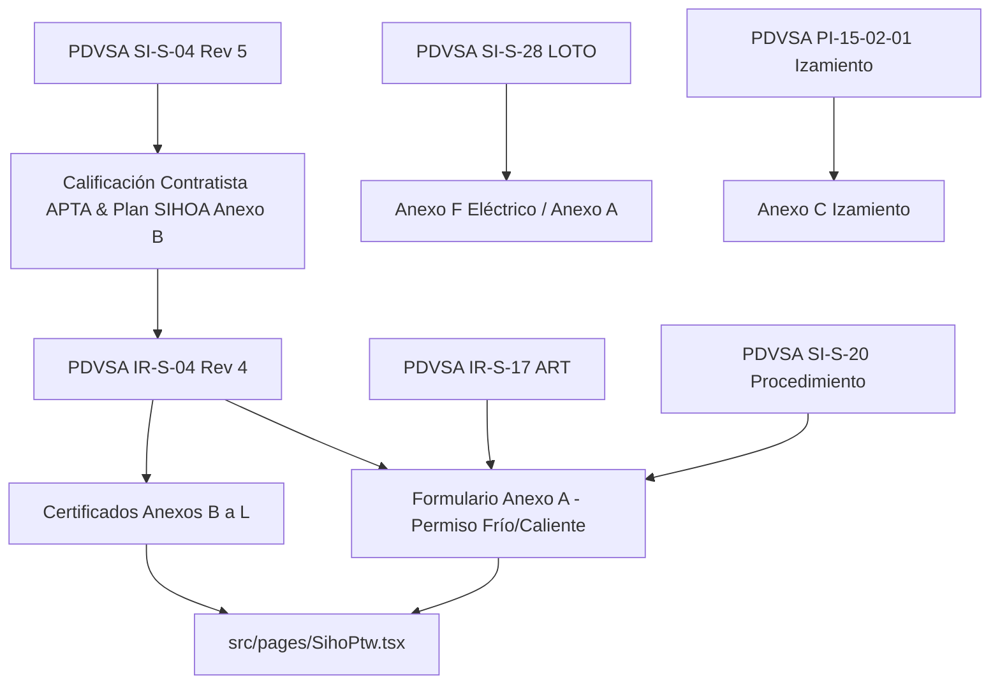

# WF-043: MATRIZ DE DEPENDENCIA DE FUENTES FUENTE-CÓDIGO

**Workflow:** WF-043 — Sistema de Permisos de Trabajo (Frío / Caliente / Especiales)  
**Agente Auditor:** Antigravity  
**Fecha:** 2026-08-10  
**Repositorio Destino:** `wolvesglobalsolutionsgroup-rgb/Industrial-360-App-GAIS`  

---

## 1. FUENTES PRIMARIAS VERIFICADAS (AUTORIDAD MÁXIMA - NIVEL A)

| ID Fuente | Documento Oficial | Revisión / Fecha | Nivel Autoridad | Ubicación / Referencia | Estado |
|---|---|---|---|---|:---:|
| `SRC-IR-S-04` | PDVSA IR-S-04 — *Sistema de Permisos de Trabajo* | Rev. 4 (Agosto 2013) | **Nivel A (PDF Oficial)** | `PDVSA_IR-S-04_Rev4_Ago2013.pdf` | `CONFIRMED` |
| `SRC-IR-S-17` | PDVSA IR-S-17 — *Análisis de Riesgos del Trabajo (ART)* | Rev. Octubre 2006 | **Nivel A (PDF Oficial)** | `PDVSA_IR-S-17_OCTUBRE-2006.pdf` | `CONFIRMED` |
| `SRC-SI-S-20` | PDVSA SI-S-20 — *Procedimientos de Trabajo* | Rev. Noviembre 2006 | **Nivel A (PDF Oficial)** | `PDVSA_SI-S-20_NOVIEMBRE-2006.pdf` | `CONFIRMED` |
| `SRC-SI-S-28` | PDVSA SI-S-28 — *Control de Fuentes de Energía (LOTO)* | Rev. Junio 2010 | **Nivel A (PDF Oficial)** | `PDVSA_SI-S-28_JUNIO-2010.pdf` | `CONFIRMED` |
| `SRC-SI-S-04` | PDVSA SI-S-04 — *Requisitos SIHOA en Contratación* | Rev. 5 (Junio 2011) | **Nivel A (PDF Marco / Supporting)** | `PDVSA_SI-S-04...pdf` | `CONFIRMED` |
| `SRC-PI-15-02-01` | PDVSA PI-15-02-01 — *Requisitos de Seguridad en Izamiento* | Rev. P6 Compress | **Nivel A (PDF Oficial)** | `pi-15-02-01...pdf` | `CONFIRMED` |
| `SRC-API-1104` | API 1104 — *Welding of Pipelines and Related Facilities* | 22nd Ed. (2021) | **Nivel A (PDF Oficial)** | `API-1104_22ed_2021.pdf` | `CONFIRMED` |
| `SRC-ASME-B31.3` | ASME B31.3 — *Process Piping* | Edición 2024 | **Nivel A (PDF Oficial)** | `ASME-B31.3-2024.pdf` | `CONFIRMED` |

---

## 2. FUENTES REFERENCIADAS FALTANTES (`MISSING_SOURCE`)

| ID Referencia | Norma Referenciada | Título / Objeto Técnico | Ámbito de Aplicación en WF-043 | Estado |
|---|---|---|---|:---:|
| `REF-HO-H-06` | PDVSA HO-H-06 | *Guía de Higiene y Seguridad en Espacios Confinados* | Anexo B (Espacios Confinados) | `MISSING_SOURCE` |
| `REF-SI-S-27` | PDVSA SI-S-27 | *Andamios: Requisitos de Seguridad* | Anexo J (Trabajos en Altura) | `MISSING_SOURCE` |
| `REF-SI-S-31` | PDVSA SI-S-31 | *Seguridad Industrial para Trabajos en Altura* | Anexo J (Trabajos en Altura) | `MISSING_SOURCE` |
| `REF-SI-S-29` | PDVSA SI-S-29 | *Seguridad y Salud en Sistemas Eléctricos Alta Tensión* | Anexo F (Sistema Eléctrico) | `MISSING_SOURCE` |
| `REF-SI-S-32` | PDVSA SI-S-32 | *Seguridad y Salud en Sistemas Eléctricos Baja Tensión* | Anexo F (Sistema Eléctrico) | `MISSING_SOURCE` |
| `REF-COVENIN-2247` | COVENIN 2247 | *Excavaciones a Cielo Abierto y Subterráneas* | Anexo E (Excavación) | `MISSING_SOURCE` |
| `REF-COVENIN-2116` | COVENIN 2116 | *Andamios. Requisitos de Seguridad* | Anexo J (Altura) | `MISSING_SOURCE` |
| `REF-COVENIN-2245` | COVENIN 2245 | *Escaleras, Rampas y Pasarelas* | Anexo J (Altura) | `MISSING_SOURCE` |
| `REF-IR-S-16` | PDVSA IR-S-16 | *Determinación de Zonas de Seguridad en Corredores* | Anexo I (Áreas Compartidas) | `MISSING_SOURCE` |
| `REF-SI-S-19` | PDVSA SI-S-19 | *Gestión y Control de Desviaciones* | Secciones 6.11 y 8.1.1.e | `MISSING_SOURCE` |
| `REF-PR-H-08` | PDVSA PR-H-08 | *Transporte de Fuentes Radiactivas / Protección Radiológica* | Anexo D (Radiaciones) | `MISSING_SOURCE` |
| `REF-ASME-B30.5` | ASME B30.5 | *Mobile and Locomotive Cranes* | Anexo C (Izamiento) | `MISSING_SOURCE` |

---

## 3. DEPENDENCIAS DOCUMENTAL-CÓDIGO

