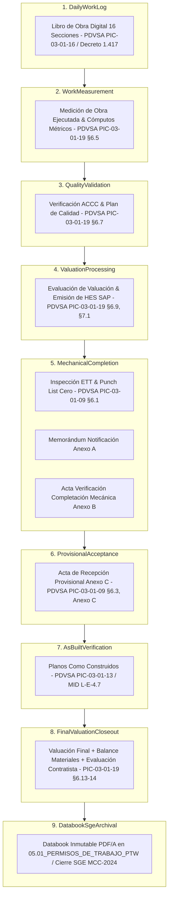

# WF-053: MATRIZ DE DEPENDENCIA DE FUENTES Y ARQUITECTURA DE CAPAS

**Workflow:** WF-053 — Completación Mecánica, Cómputos Métricos, Valuaciones y Cierre Contractual SGE  
**Agente Auditor:** Antigravity  
**Fecha:** 2026-08-10  
**Confianza General:** `HIGH`  

---

## 1. FUENTES PRIMARIAS DE GOBERNANZA

| ID Fuente | Documento Oficial | Revisión / Fecha | Nivel Autoridad | Ubicación Local / Referencia | Estado |
|---|---|---|---|---|:---:|
| `SRC-PIC-03-01-09` | PDVSA PIC-03-01-09 — *Completación Mecánica* | Julio 2009 | **Gobernanza Primaria (Completación / Actas)** | `PDVSA_PIC-03-01-09...pdf` (9 Págs.) | `CONFIRMED` |
| `SRC-PIC-03-01-16` | PDVSA PIC-03-01-16 — *Libro de Obra* | Diciembre 2009 | **Gobernanza Primaria (Libro de Obra 16 Secciones)** | `PDVSA_PIC-03-01-16...pdf` (8 Págs.) | `CONFIRMED` |
| `SRC-PIC-03-01-19` | PDVSA PIC-03-01-19 — *Pago de Valuaciones de Obra* | Diciembre 2009 | **Gobernanza Primaria (Valuaciones & HES SAP)** | `pic-03-01-19-valuac_compress.pdf` (7 Págs.) | `CONFIRMED` |
| `SRC-PIC-03-01-13` | PDVSA PIC-03-01-13 — *Planos Como Construidos* | Diciembre 2009 | **Gobernanza Primaria (As-Built)** | `pic-03-01-13-planos...pdf` (6 Págs.) | `CONFIRMED` |
| `SRC-MCC-2024` | PDVSA Manual Corporativo de Contratación | Marzo 2024 | **Marco Legal / Cierre Contractual SGE** | `PDVSA_MANUAL-CORPORATIVO...pdf` (92 Págs.) | `CONFIRMED` |

---

## 2. ESTRUCTURA DE CAPAS SEPARADAS DE ARQUITECTURA

