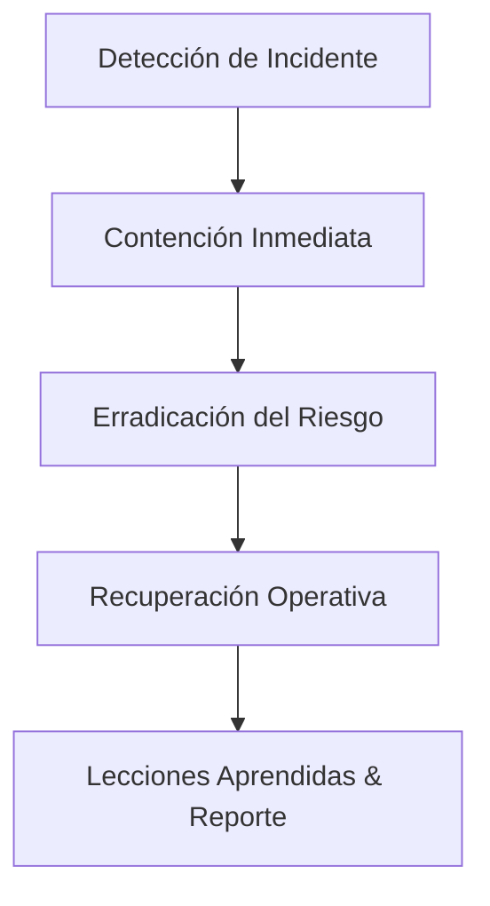
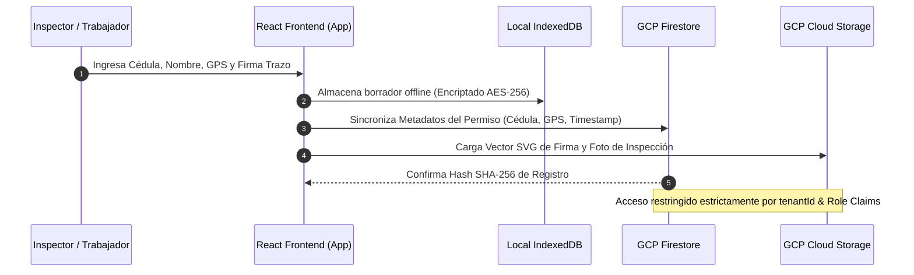

# ANÁLISIS DE BRECHAS DE CIBERSEGURIDAD Y MODELO DE AMENAZAS (V2)

**Producto:** IC360-NEXUS (`Industrial-360-App`)  
**Estatus:** Especificación Refinada V2 — Producción  
**Fecha:** Agosto 2026  
**Marcos Integrados:** IEC 62443 (SL1-SL2), OWASP ASVS 4.0 (Nivel 2), ISO/IEC 27001 (Anexo A), Ley de Protección de Datos Personales / GDPR, Ley de Mensajes de Datos y Firmas Electrónicas (VE).  

---

## 1. RESUMEN DE BRECHAS NORMATIVAS POR MARCO

### A. IEC 62443 (Ciberseguridad Industrial SL1-SL2)
- **Cumplidos:** Authentication & Identification (SR 1.1), RBAC via Custom Claims (SR 2.1), Trazabilidad Criptográfica SHA-256 (SR 2.8), Encriptación en Tránsito/Reposo TLS 1.3/AES-256 (SR 4.1).
- **Brechas Aisladas:** SR 1.3 (Revocación instantánea de Firebase Custom Claims en tokens activos) y SR 1.7 (Políticas de complejidad forzada de credenciales en Auth).

### B. OWASP ASVS 4.0 Nivel 2
- **Cumplidos:** Tenant Isolation via Firestore Security Rules (V1), Sanitize PII en Sentry (V7), Criptografía en Cadena Inmutable (V6), Cero Secretos en Cliente (V8).
- **Brechas Aisladas:** V5 (Validación Zod estricta en el 100% de los endpoints de Cloud Functions).

---

## 2. THREAT MODELING STRIDE POR WORKFLOW CRÍTICO

### WF-043: Permiso de Trabajo Seguro (PTW)
- **Actores:** Custodio de Instalación (Aprueba/Firma), Ejecutor de Trabajo (Solicita), Inspector SIHO (Audita).
- **Amenazas STRIDE & Mitigaciones:**
  - *Spoofing:* Falsificación de identidad de inspector. → **Mitigación:** Firebase Auth MFA + Custom Claims `role == 'SIHO_INSPECTOR'`. Evidencia: `src/utils/auth.ts`.
  - *Tampering:* Alteración posterior de un PTW aprobado. → **Mitigación:** Cadena SHA-256 inmutable en `auditChain.ts`. Evidencia: `src/services/auditChain.ts`.
  - *Repudiation:* Negación de firma por parte del ejecutante. → **Mitigación:** Sello de tiempo RFC 3161 + IP + Cédula registrada.
  - *Information Disclosure:* Fuga de detalles operativos de la planta. → **Mitigación:** Firestore Security Rules filtradas por `tenantId`. Evidencia: `firestore.rules`.
  - *Denial of Service:* Saturación de emisión de permisos en paradas de planta. → **Brecha Restante:** Falta Rate Limiting dinámico a nivel de API Gateway por tenant IP.
  - *Elevation of Privilege:* Operador elevándose a custodio. → **Mitigación:** Verificación de rol en backend con claims encriptadas.

### WF-044: Análisis de Riesgo en el Trabajo (ART)
- **Actores:** Supervisor de Campo (Crea), Equipo de Trabajo (Firma en sitio), Asesor SIHO (Valida).
- **Amenazas STRIDE & Mitigaciones:**
  - *Spoofing:* Captura de firma de un trabajador ausente. → **Mitigación:** Captura de geolocalización GPS obligatoria al momento del trazo. Evidencia: `src/components/SignatureCanvas.tsx`.
  - *Tampering:* Modificación de riesgos identificados post-incidente. → **Mitigación:** Hash estático del documento ART adjunto al PTW (Tríada imitable).
  - *Repudiation:* Desconocimiento de charla de seguridad de 5 minutos. → **Mitigación:** Lista de asistencia foliada con firma digital.

### WF-052: Calibración e Inspección de Equipos (QA/QC)
- **Actores:** Inspector QA/QC (Registra), Certificador Externo (Aprueba).
- **Amenazas STRIDE & Mitigaciones:**
  - *Tampering:* Falsificación de fechas de vencimiento de calibración de manómetros. → **Mitigación:** Hash QR de verificación pública en tiempo real.
  - *Information Disclosure:* Acceso de contratistas a certificados de otras empresas. → **Mitigación:** Aislamiento estricto por `tenantId` en almacenamiento de Storage (`/tenants/{tenantId}/certs/`).

### WF-053: Actas de Entrega y Recepción de Obra
- **Actores:** Gerente de Proyecto PDVSA (Firma Aceptación), Residente de Obra (Entrega).
- **Amenazas STRIDE & Mitigaciones:**
  - *Tampering:* Inclusión tardía de valorizaciones o APUs no ejecutados. → **Mitigación:** Cierre de folio digital correlativo inmutable.
  - *Repudiation:* Cuestionamiento de valuaciones aprobadas. → **Mitigación:** Hash SHA-256 bipartito consolidado en PDF A4 final.

---

## 3. PLAN DE RESPUESTA A INCIDENTES DE CIBERSEGURIDAD (IRP)

### Escenario 1: Credencial o API Key Filtrada en Repositorio Público
1. **Detección:** Alerta automatizada de GitHub Secret Scanning o Semgrep `p/secrets`.
2. **Contención:** Invalidez inmediata de la clave expuesta en la consola de Google Cloud Platform (GCP IAM) o Firebase.
3. **Erradicación:** Revocación de secretos, purga del historial de git con `git-filter-repo`.
4. **Recuperación:** Despliegue de nuevo secreto rotado a través de GCP Secret Manager.
5. **Lecciones:** Implementación de pre-commit hooks con `git-leaks`.

### Escenario 2: Reporte de Borrado Accidental o Malicioso de PTW Firmado
1. **Detección:** Notificación del usuario o excepción de documento no encontrado en auditoría.
2. **Contención:** Inhabilitación de borrados lógicos en Firestore asignando flag `isDeleted: true` manteniendo el documento físico.
3. **Erradicación:** Verificación de registros en el log inmutable `auditChain.ts`.
4. **Recuperación:** Restauración instantánea desde GCP Point-in-Time Recovery (PITR) a nivel de colección.
5. **Lecciones:** Refuerzo de `firestore.rules` prohibiendo la operación `delete` en colecciones firmadas.

### Escenario 3: Corrupción o Pérdida de Datos en Firestore
1. **Detección:** Fallo en la verificación de hash de la cadena `auditChain` durante una auditoría.
2. **Contención:** Bloqueo de escritura en el tenant afectado (`tenant_read_only = true`).
3. **Erradicación:** Identificación de la transacción corrupta comparando el estado local con la copia en Storage.
4. **Recuperación:** Ejecución del script de restauración de backups diarios GCP Firestore Export.
5. **Lecciones:** Habilitación de alertas de discrepancia en tiempo real para el Hash Chain.

### Escenario 4: Ataque de Denegación de Servicio (DoS) a Cloud Functions
1. **Detección:** Alerta de Sentry / GCP Cloud Monitoring por consumo pico de CPU/RAM o respuestas 429/503.
2. **Contención:** Activación de Cloud Armor WAF y Rate Limiting agresivo (100 req/min por IP).
3. **Erradicación:** Bloqueo de rangos IP maliciosos y habilitación de Firebase App Check con reCAPTCHA Enterprise.
4. **Recuperación:** Normalización del escalado automático de Cloud Functions.
5. **Lecciones:** Establecimiento de presupuestos de invocación máxima en GCP.

---

## 4. DATA FLOW DIAGRAM (DFD) Y TRAZABILIDAD DE PII

- **Captura:** Cédula, Nombres, Fotografías de Inspección, Trazo de Firma y Coordenadas GPS en `src/components/forms/`.
- **Almacenamiento:** Firestore (`/tenants/{tenantId}/ptw/`), Cloud Storage (`/tenants/{tenantId}/signatures/`), IndexedDB en navegador local.
- **Acceso:** Exclusivo para usuarios autenticados del mismo `tenantId` con roles `SIHO_INSPECTOR`, `CUSTODIO`, o `GERENTE_OBRA`.
- **Retención:** 10 años por exigencia legal de seguridad industrial PDVSA/COVENIN.

---

## 5. POLÍTICA DE RETENCIÓN Y DERECHO AL OLVIDO (ANONIMIZACIÓN SEGRA)

Para cumplir con las leyes de protección de datos personales sin romper la integridad criptográfica del Hash Chain:

1. **Desacoplamiento de PII:** Los datos sensibles del trabajador (Nombre, Cédula, Foto) se almacenan en un perfil independiente vinculado por `workerId`.
2. **Procedimiento de Borrado / Anonimización:** Al procesar una solicitud de Derecho al Olvido, la PII en el perfil del trabajador se reemplaza con la cadena hash anónima:  
   `ANONIMO_WORKER_HASH_SHA256(workerId)`.
3. **Preservación del Hash Chain:** Los permisionamientos, firmas y auditorías históricas retienen el hash del evento original. El Hash Chain de la auditoría se mantiene 100% válido matemáticamente mientras la identidad del individuo queda irrevocablemente anonimizada.
